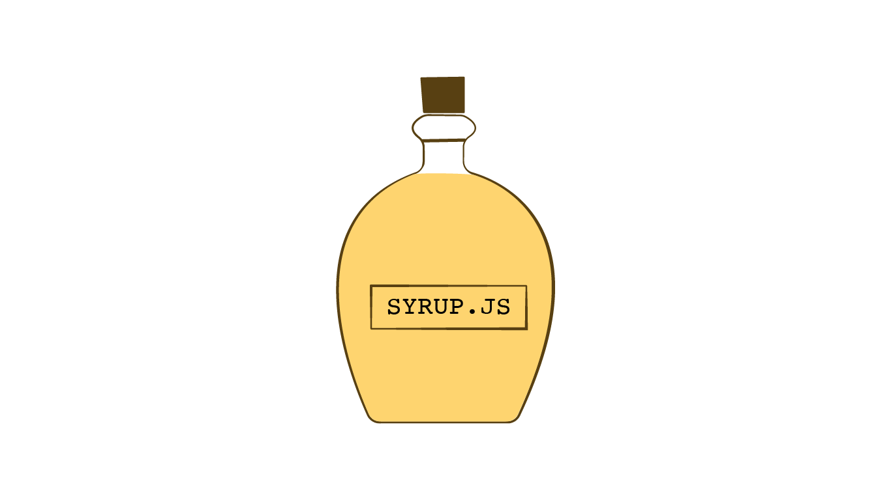

# syrupjs
[](https://travis-ci.org/ahmed-musallam/syrupjs) 

>A tiny pub/sub micro-framework for distant component interaction enabled by [jquery-tiny-pubsub](https://github.com/cowboy/jquery-tiny-pubsub)
> 
> **To be clear**, one-way interactions via pub-sub pattern.



## Getting syrup.js
You can download from the `dist` folder
or you can build from source, clone the repo then `npm start`, the minified library will be in `dist/syrup.min.js`

> the `npm start` script minifies and concatenates syrup.js and [jquery-tiny-pubsub](https://github.com/cowboy/jquery-tiny-pubsub)

## Why another js framework
this one is less that 1KB and does one thing, create a declarative way to publish custom events when native JS events are triggered.

## Let me explain
When building components with react, angular or any other "bundled" framework, components have a defined way of interaction (defined by the framework). But when building server-side components on a CMS, such as Adobe Experience Manager (AEM), those components are effectively HTML partials that are rendered separately then stitched together to form the HTML doc, essentially to enable a fantastic component authoring experience. As such, there is no good way to communicate between components.

> Syrup is jQuery-dependent on purpose since the majority of sites built with CMS's such as AEM are jQuery based.
> If you are already using a framework that allows component interactions, syrup's not for you!

## Enter syrupjs!
syrupjs publishes native JS events such as `click` with a custom name. Components can subscribe to the event and react accordingly.

> Syrup's pub/sub is enabled by the amazingly minuscule [jquery-tiny-pubsub](https://github.com/cowboy/jquery-tiny-pubsub)
> syrupjs embeds `jquery-tiny-pubsub`


## Example
you have a button component

```html
<button data-syrup="click:show-me-the-money">
  show me the money
</button>
```
> notice the `data-syrup="click:show-me-the-money"` we'll get to that in a bit

And you have a money component that is hidden by default

```html
<div class="js-money" style="display:none">
 MONEY!
</div>
```
and you set your money component JS to listen for `show-me-the-money` event:

```javascript
 $(function(){
 	$.subscribe('show-me-the-money', function(){
 		$('.js-money').show();
 	})
 })
```

viola! when you click on the button, the `.js-money` element is displayed!

> working jsfiddle: [https://jsfiddle.net/6598m77o/](https://jsfiddle.net/6598m77o/)

You can see how this pattern can enable component interactions, where each component subscribes to certain events in order to change it's state (that is, it's the actual DOM).


## `data-syrup`
The core of this library is the `data-syrup` attributes, the value of that attribute is defined by the following BNF

```
<attribute-value>       ::= <comma-separated-pairs>
<comma-separated-pairs> ::= <pair> | <pair> , <comma-separated-pairs>
<pair>                  ::= <native-js-event> : <custom-event-to-publish>
```

the following values are valid:

* `click:custom-event`
* `click:custom-click-event,focus:custom-focus-event`
* `mouseenter:show-me-the-money, mouseleave:hide-the-money, click:make-mony-blue`

effectively a comma separated pairs, where each pair is colon-separated. The first value of the pair is a native JS event that will be registered to the current element. The second is a custom event name to be published when the native Js event is triggered.

> The native event name is passed to jQuery's [.on](http://api.jquery.com/on/) method.
> 
> If an event does not work on a specific element, make sure to test it independently `$(<selector>).on(<event>, console.log)`or read the event documentation to see if the target element has issues with that particular event.
> 
> Refer to javascript's [native events](https://developer.mozilla.org/en-US/docs/Web/Events) for the complete list.

`<button data-syrup="click:custom-event">` = on click of this button, publish the event `custom-event`.

## Initializing syrup elements dynamically
If you are creating elements dynamically and setting the `data-syrup` attribute on an element, you can trigger syrup initialization for the new element with `$('.your-element').syrup()`

## The `$.subscribe` method
The `$.subscribe` method is provided by [jquery-tiny-pubsub](https://github.com/cowboy/jquery-tiny-pubsub) which is included with syrupjs.

```
$.subscribe(<event-name>, callback)
```
where `callback` is `Function(customEvent, originalJSEvent, sourceElement)`

> custom params are coming soon

example:

```html
<button data-syrup="click:say-hi">say hi<button>
<div class="js-text"><div>
```

```javascript
$(function(){
  $.subscribe('say-hi', function(customE, originalE, originalEl){
    console.log(customE) // this is the `say-hi` event
    console.log(originalE) // this is the click event
    console.log(originalEl) // this is the clicked element
    $('.js-text').html('hello there')
<button>
  });
})
```